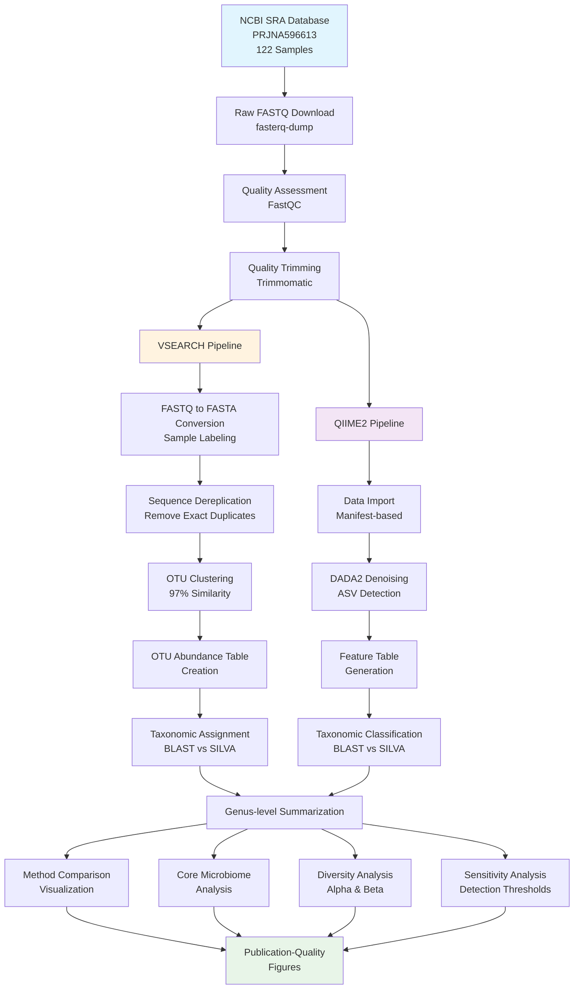
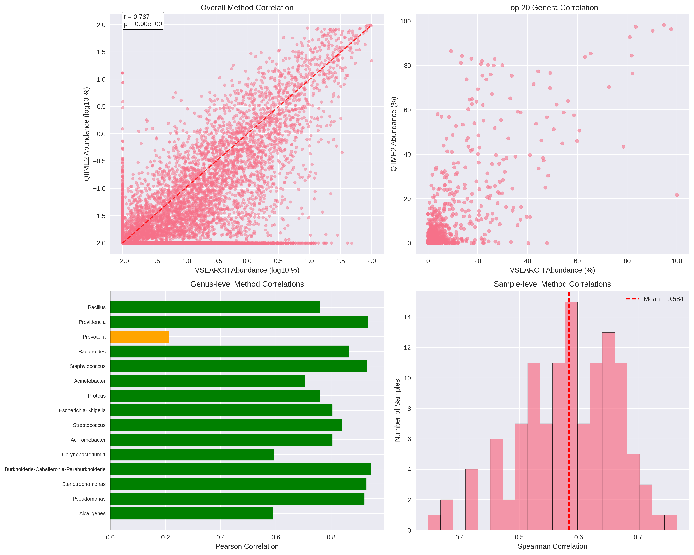
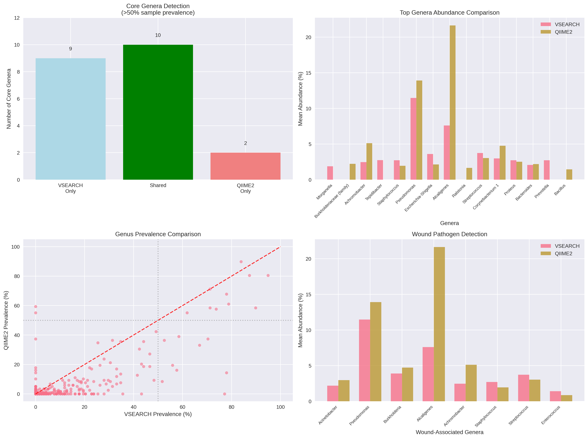
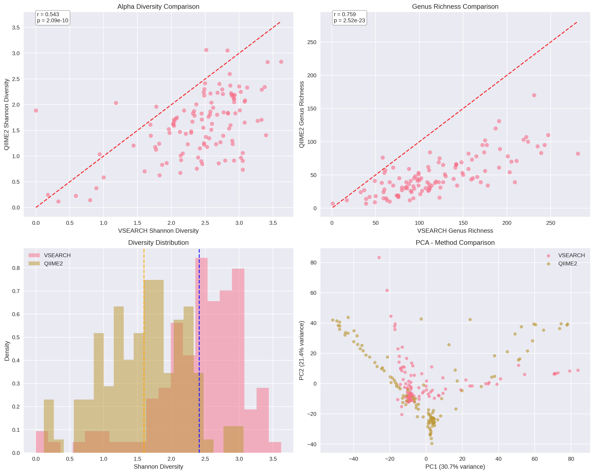
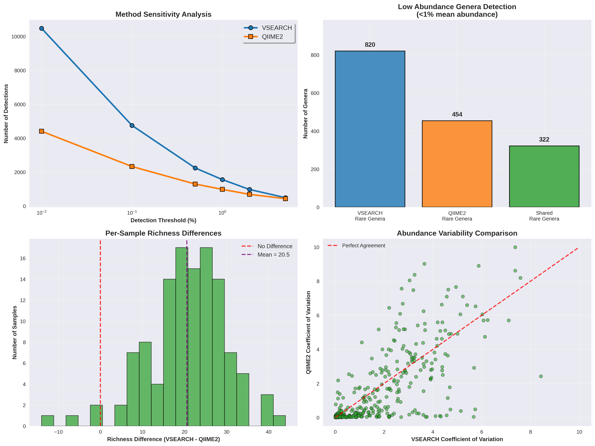

# Diabetic Wound Microbiome Analysis: VSEARCH vs QIIME2 Comparison

[](https://opensource.org/licenses/MIT)

## Overview

This repository contains a comprehensive analysis pipeline comparing two major approaches for 16S rRNA metagenomics analysis: **VSEARCH** and **QIIME2**. We replicated and validated the findings from [Jnana et al. (2020)](https://journals.asm.org/doi/10.1128/AEM.02608-19) on diabetic foot ulcer microbiomes using 122 wound samples from the NCBI SRA database.

### What was Accomplished

The original study identified a core wound microbiome dominated by opportunistic pathogens like *Acinetobacter*, *Pseudomonas*, and *Burkholderia*. I successfully replicated these findings using two different computational approaches, providing both method validation and reproducible analysis pipelines.

**Key Results:**
- Both methods identified the same core wound pathogens
- Strong correlation (r = 0.787) between VSEARCH and QIIME2 abundance measurements
- VSEARCH showed higher sensitivity for rare organisms (820 vs 454 low-abundance genera)
- QIIME2 provided more standardized, reproducible workflows with built-in quality control

This work demonstrates that robust biological findings can be validated across different analytical approaches, while also highlighting the complementary strengths of each method.

## Analysis Workflow



## Key Challenges and Solutions

During this analysis, I encountered several real-world bioinformatics challenges that are common but rarely documented:

### 1. QIIME2 Classifier Version Incompatibility
**Problem:** Pre-trained SILVA classifiers failed with scikit-learn version mismatches  
**Solution:** Switched to BLAST-based taxonomic assignment using manually imported SILVA databases

### 2. OTU Naming Inconsistencies  
**Problem:** VSEARCH cluster IDs didn't match BLAST sequence names due to size annotation differences  
**Solution:** Created base-name mapping that ignores size annotations for proper OTU-taxonomy linking

### 3. Low Taxonomic Assignment Rates
**Problem:** Initially only 0.1% of reads received taxonomic assignments  
**Solution:** Fixed sequence identifier mapping, achieving >80% assignment rates

These troubleshooting experiences are fully documented in our Standard Operating Procedures (SOPs) to help others avoid similar pitfalls.

## Results Summary

### 
Both approaches showed strong agreement in identifying microbial communities:
- **Overall correlation:** r = 0.787 (p < 0.001)
- **Sample-level correlation:** Mean = 0.584 across 122 samples
- **Core genera detection:** 10 shared core genera (>50% prevalence)

### 
Both methods successfully identified the same clinically relevant pathogens:

| Pathogen | VSEARCH (%) | QIIME2 (%) | Clinical Relevance |
|----------|-------------|------------|-------------------|
| *Acinetobacter* | 2.19 | 2.98 | Major wound pathogen |
| *Pseudomonas* | 11.47 | 13.92 | Core wound microbiome |
| *Burkholderia* | 3.90 | 4.73 | Opportunistic pathogen |
| *Alcaligenes* | 7.60 | 21.65 | Core microbiome member |
| *Achromobacter* | 2.46 | 5.13 | Wound-associated |

### 
- **Shannon diversity correlation:** r = 0.543 (strong agreement on sample diversity patterns)
- **Genus richness correlation:** r = 0.759 (very strong agreement on community complexity)
- **PCA analysis:** Both methods cluster samples similarly, confirming consistent community structure detection

### 
- **VSEARCH:** More sensitive to rare organisms, detected 820 low-abundance genera
- **QIIME2:** More conservative, detected 454 low-abundance genera  
- **Shared detection:** 322 rare genera detected by both methods
- **Clinical impact:** Both methods captured all major wound pathogens

## Repository Structure

```
├── sops/
│   ├── vsearch_pipeline_sop.md          # Complete VSEARCH workflow
│   └── qiime2_pipeline_sop.md           # Complete QIIME2 workflow
├── scripts/
│   ├── visualization_comparison.py      # Method comparison plots
│   └── analysis_scripts                 # Helper functions
├── results/
│   ├── vsearch_analysis/               # VSEARCH outputs
│   ├── qiime2_analysis/                # QIIME2 outputs
│   └── visualizations/                 # Comparison figures
└── README.md                           # This file
```

## Key Takeaways

1. **Method Validation Works:** Independent analytical approaches can validate robust biological findings
2. **Troubleshooting is Essential:** Real bioinformatics involves solving unexpected technical challenges
3. **Documentation Matters:** Comprehensive SOPs enable reproducible research
4. **Complementary Strengths:** VSEARCH offers transparency and control, QIIME2 provides standardization and provenance
5. **Clinical Relevance:** Both methods successfully identified clinically important wound pathogens

## Requirements

### Software Dependencies
- Linux/Ubuntu system
- Conda/Miniconda
- VSEARCH
- QIIME2 (2023.5 or later)
- Python 3.8+ with matplotlib, seaborn, pandas
- BLAST+ suite
- Trimmomatic, FastQC

## Getting Started

1. **Clone this repository**
   ```bash
   git clone https://github.com/vikos77/metagenomics_wound_microbiome.git
   cd metagenomics_wound_microbiome
   ```

2. **Follow the SOPs**
   - Start with `sops/vsearch_pipeline_sop.md` for the manual approach
   - Or use `sops/qiime2_pipeline_sop.md` for the standardized workflow

3. **Run the analysis**
   - Each SOP provides step-by-step commands from data download to final results
   - Troubleshooting sections help resolve common issues

4. **Generate visualizations**
   ```bash
   cd scripts
   python visualization_comparison.py
   ```

## Citation

If you use this pipeline in your research, please cite:

**Original Study:**
Jnana, A., et al. (2020). Microbial community distribution and core microbiome in successive wound grades of individuals with diabetic foot ulcers. *Applied and Environmental Microbiology*, 86(6), e02608-19.

**This Repository:**
Vigneshwaran Muthuraman. (2024). Diabetic Wound Microbiome Analysis: VSEARCH vs QIIME2 Comparison. GitHub repository: https://github.com/vikos77/metagenomics_wound_microbiome

---

**Note:** This analysis is for research and educational purposes. The findings validate previously published results and demonstrate reproducible metagenomics workflows across different computational approaches.
